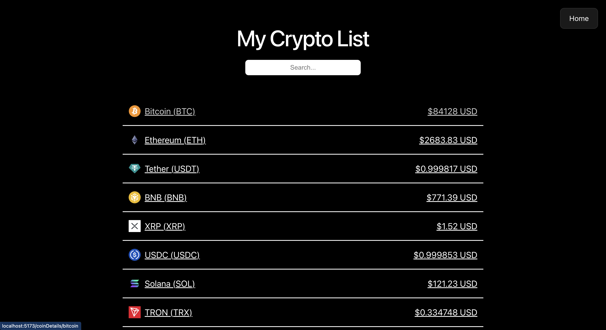
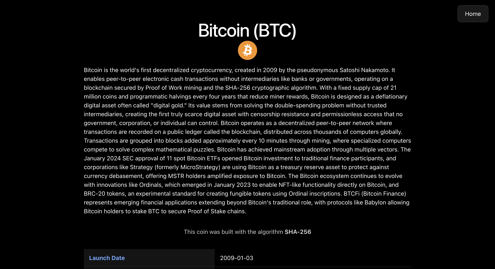
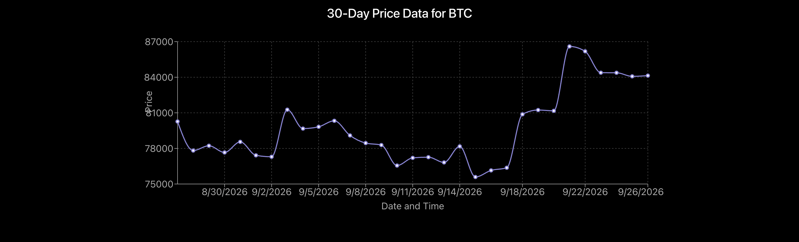
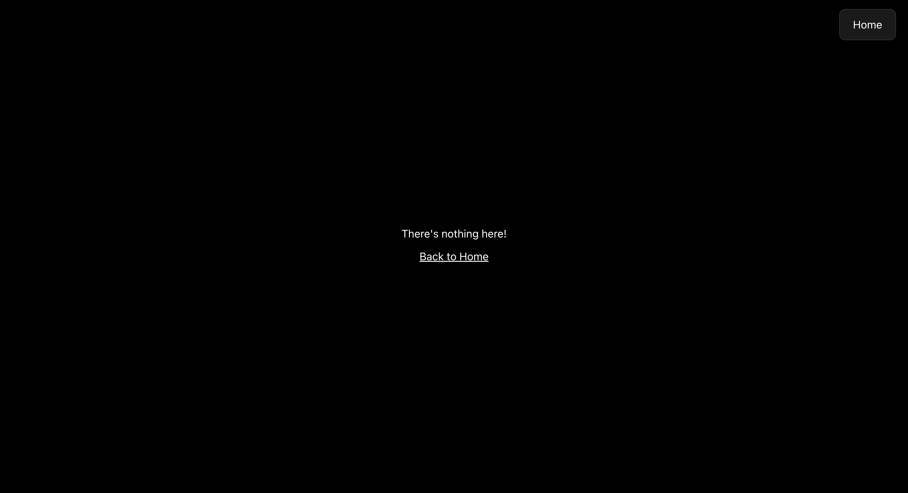

# 💸 Crypto Hustle Pro

A multi-page cryptocurrency dashboard built with React, Vite, and React Router. It extends [Crypto Hustle Lite](../crypto-hustle) by giving every coin its own URL and a detail page with a description, stats, and a 30-day price chart. Data comes from the CoinGecko API.

Built for CodePath WEB 102, Unit 5 Lab.

## Features

### Required
- Clicking a coin in the list opens a detail page with more about it: description, algorithm, launch date, links, and price stats
- Every coin has a direct, unique URL of its own (`/coinDetails/:id`) powered by React Router
- A search bar filters the list by coin name or symbol
- A "Not Found" page for any URL that doesn't match a defined route

### Stretch
- A 30-day price line chart on each coin's detail page (Recharts)
- In-flight chart requests are cancelled with an `AbortController` when navigating away, so intentional cancellations don't flood the console

## Routes

| Path | Renders | Notes |
| --- | --- | --- |
| `/` | `Home` | Coin list + search |
| `/coinDetails/:id` | `DetailView` → `CoinDetail` | Reads `:id` with `useParams()` |
| `*` | `NotFound` | Catch-all for undefined URLs |

## Walkthrough

### Home page
The list of coins as clickable links, each with its icon, name, symbol, and USD price, plus a search bar. A Home button is pinned to the top-right on every page.



### Coin detail page
Clicking a coin routes to its own URL and shows the title, icon, description, algorithm, and a stats table (launch date, website, whitepaper, price, volume, high/low, market cap, and more).



### Stretch: 30-day price chart
Each detail page renders a line chart of the coin's closing price over the last 30 days.



### Not Found page
Any URL that doesn't match a route shows a friendly message with a link home.



### Demo
A full run: browse the list, click into a coin, view its stats and chart, and hit a bad URL.

<!-- Upload demo.mov on github.com and paste ONLY the generated user-attachments link on the blank line below (no other text) -->


## What I practiced
- Configuring React Router: `BrowserRouter`, `Routes`, `Route`, a dynamic `:param` route, and a `*` no-match route
- Reading URL params with `useParams()` to fetch the right coin
- Navigating between pages with `Link` (each coin links to its own detail URL)
- Making multiple API calls across components and rendering the results
- Rendering a data visualization with Recharts
- Cancelling in-flight fetches with an `AbortController` in a `useEffect()` cleanup

## Running locally

```bash
npm install
npm run dev
```

Then open the `http://localhost:5173/` link that Vite prints. Run only one dev server at a time to stay within CoinGecko's keyless rate limits.

### Environment variables
This project reads a CoinGecko demo API key from a `.env` file at the project root:

```
VITE_APP_API_KEY="your-coingecko-demo-api-key"
```

## Tech stack
- React 19
- React Router
- Recharts
- Vite

## API used
- [CoinGecko API](https://docs.coingecko.com/) — coin list (`/coins/markets`), coin details (`/coins/{id}`), and 30-day history (`/coins/{id}/market_chart`)

## A note on the data source
The CodePath walkthrough uses the CryptoCompare API. As of May 2026, CryptoCompare (now CoinDesk Data) retired its free API tier, so its endpoints return `401 Unauthorized` without a paid subscription. This project uses CoinGecko's keyless demo API instead. The React Router concepts (nested routes, URL params, `Link`, no-match route) and the chart/`AbortController` stretch goals are identical; only the data source and field names differ. Detail pages are keyed by CoinGecko coin `id` (e.g. `/coinDetails/bitcoin`) rather than by symbol.
